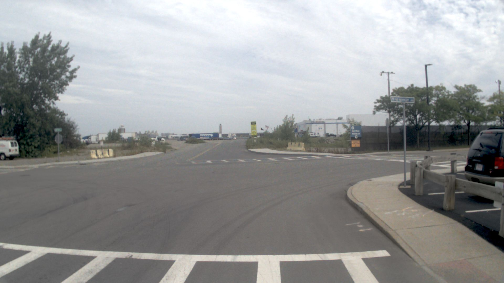
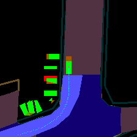

# Design of Dataset
## Example Pic

1920*1080




## Scene Description (input: sensor)
### Environment Description
The scene description module identifies the driving environment and critical objects. The driving environment can be described by several key conditions that impact driving difficulty, collectively represented as:
$$
\{E_{weather}, E_{time}, E_{road}, E_{lane}\}
$$

- **$E_{weather}$**: Spans conditions from sunny to snowy, affecting visibility and traction.
- **$E_{time}$**: Indicates daytime or nighttime, influencing driving strategies due to visibility changes.
- **$E_{road}$**: Represents road types, such as urban or highway, introducing different challenges to driving.
- **$E_{lane}$**: Focuses on the current lane positioning and possible maneuvers, crucial for safe driving decisions.

### Critical Object Identification
In addition to environmental conditions, identifying critical objects in the driving scenario is essential for safe driving decisions. Each critical object, denoted as $O_c$, includes:
- Object category $c$
- Approximate bounding box coordinates $b(x_1, y_1, x_2, y_2)$ on the image

These attributes are mapped to language token IDs, enabling integration with subsequent modules.


## Scene Analysis (input: sensor)
The scene analysis module provides a comprehensive understanding of the driving environment and critical objects. 

### Critical Object Analysis
Critical objects are analyzed from three perspectives:
- **Static attributes ($C_s$)**: Properties like the visual cues of roadside billboards or the oversized cargo of a truck.
- **Motion states ($C_m$)**: Describes the object's dynamics, such as position, direction, and action.
- **Particular behaviors ($C_b$)**: Refers to special actions, like a pedestrian's gesture, that could influence the ego vehicle's next decision.


## Hierarchical Planning (input: bev and trajectory)
Once the scene-level summary is generated, it is combined with the route, ego vehicle's pose, and velocity to inform planning. Planning occurs in three stages:

### Meta-actions ($A$)
Meta-actions represent short-term driving decisions, such as accelerating, decelerating, turning, or changing lanes.

| **Category**          | **Meta-actions**                                                                                     |
|-----------------------|-----------------------------------------------------------------------------------------------------|
| **Speed-control actions** | Speed up, Slow down, Slow down rapidly, Go straight slowly, Go straight at a constant speed, Stop, Wait, Reverse |
| **Turning actions**    | Turn left, Turn right, Turn around                                                                  |
| **Lane-control actions** | Change lane to the left, Change lane to the right, Shift slightly to the left, Shift slightly to the right      |


### Decision Description ($D$)
The decision description provides a fine-grained driving strategy, including:
- **Action ($A$)**: The specific meta-action, such as 'turn' or 'accelerate.'
- **Subject ($S$)**: The object or lane involved in the interaction, such as a pedestrian or traffic signal.
- **Duration ($D$)**: Specifies when the action should occur and how long it should last.

### Trajectory Waypoints ($W$)
Trajectory waypoints, denoted as:
$$
W = \{w_1, w_2, ..., w_n\}, \quad w_i = (x_i, y_i)
$$
These waypoints define the vehicle's path over a certain future period with predetermined intervals $\Delta t$.


```json
{
    "E_weather": "Cloudy",
    "E_time": "Daytime",
    "E_road": "Urban road",
    "E_lane": "Vehicle is in the right lane, approaching an intersection with possible maneuvers to turn left, continue straight, or turn right.",
    "Critical_Objects": [
        {
            "Category": "Vehicle",
            "BoundingBox": "(915, 450, 1000, 650)",
            "Description": "A black SUV parked on the right side of the road near the intersection."
        },
        {
            "Category": "Traffic Sign",
            "BoundingBox": "(755, 330, 805, 360)",
            "Description": "A street sign indicating the name of the cross street."
        }
    ]
}
```
```json
{
    "Scene_Summary": "The scene is set during daytime under cloudy weather conditions. The ego vehicle is on an urban road, approaching an intersection from the right lane. The road is clear ahead, and there are no immediate obstacles in the lane of travel. The intersection is marked with pedestrian crosswalks and road markings. To the right, there is a black SUV parked near the intersection, and a street sign indicating the name of the cross street is visible. The overall environment suggests a typical urban setting with potential for various maneuvers at the intersection.",
    
    "Critical_Objects": [
        {
            "class": "Vehicle",
            "Characteristics": {
                "Static attributes": "The black SUV is parked on the right side of the road near the intersection. It is a stationary object with no motion.",
                "Motion states": "The SUV is not in motion; it is parked and does not pose an immediate threat to the ego vehicle's path.",
                "Particular behaviors": "There are no particular behaviors observed from the SUV, as it is parked and stationary."
            },
            "Influence": "The parked SUV does not directly influence the ego vehicle's immediate path but should be noted for potential future maneuvers, such as turning right or continuing straight."
        },
        {
            "class": "Traffic Sign",
            "Characteristics": {
                "Static attributes": "The street sign is located on the right side of the road, indicating the name of the cross street. It is a fixed object providing information about the intersection.",
                "Motion states": "The street sign is stationary and does not move.",
                "Particular behaviors": "There are no particular behaviors associated with the street sign, as it is a static object."
            },
            "Influence": "The street sign provides important information about the cross street, which can help the ego vehicle in making decisions about its route and maneuvers at the intersection."
        }
    ]
}
```
```json
{
    "Meta_Actions": [
        {
            "Action": "Speed up",
            "Subject": "Ego vehicle",
            "Duration": "0s-2s"
        },
        {
            "Action": "Turn right",
            "Subject": "Ego vehicle",
            "Duration": "2s-4s"
        },
        {
            "Action": "Maintain speed",
            "Subject": "Ego vehicle",
            "Duration": "4s-8s"
        }
    ],
    "Decision_Description": "The ego vehicle should speed up initially to approach the intersection, then turn right to follow the future trajectory, and maintain a consistent speed to safely navigate the new path."
}
```